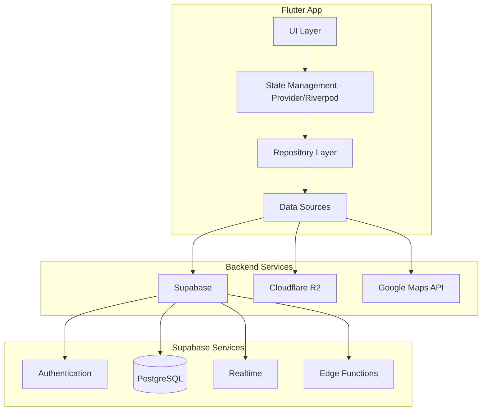
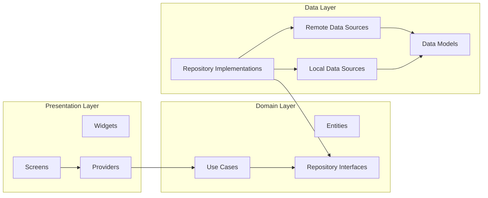

# Design Document

## Overview

This design document outlines the technical architecture for transforming the existing Flutter grocery app into a production-ready application with Supabase backend, Cloudflare R2 image storage, role-based access control, admin dashboard, and real-time delivery tracking. The system follows a clean architecture pattern with clear separation between data, domain, and presentation layers.

## Architecture

### High-Level Architecture



### Application Architecture



## Components and Interfaces

### 1. Authentication Module

```dart
// lib/core/auth/auth_service.dart
abstract class AuthService {
  Future<AuthResult> signUp(String email, String password, String name);
  Future<AuthResult> signIn(String email, String password);
  Future<void> signOut();
  Future<void> resetPassword(String email);
  Stream<AuthState> get authStateChanges;
  User? get currentUser;
  Future<UserRole> getUserRole();
}

// lib/core/auth/auth_guard.dart
class AuthGuard {
  Future<bool> canActivate(UserRole requiredRole);
  void redirectToLogin();
  void redirectToUnauthorized();
}
```

### 2. Product Management Module

```dart
// lib/features/products/domain/repositories/product_repository.dart
abstract class ProductRepository {
  Future<List<Product>> getProducts({bool includeInactive = false});
  Future<Product> getProductById(String id);
  Future<List<Product>> getProductsByCategory(String categoryId);
  Future<Product> createProduct(ProductCreateDto dto);
  Future<Product> updateProduct(String id, ProductUpdateDto dto);
  Future<void> deleteProduct(String id); // Soft delete
  Future<List<Product>> searchProducts(String query);
}

// lib/features/products/domain/entities/product.dart
class Product {
  final String id;
  final String name;
  final String description;
  final double price;
  final String categoryId;
  final String imageUrl;
  final int stockQuantity;
  final bool isActive;
  final DateTime createdAt;
  final DateTime updatedAt;
}
```

### 3. Order Management Module

```dart
// lib/features/orders/domain/repositories/order_repository.dart
abstract class OrderRepository {
  Future<List<Order>> getOrders({OrderFilter? filter});
  Future<Order> getOrderById(String id);
  Future<List<Order>> getCustomerOrders(String customerId);
  Future<Order> createOrder(OrderCreateDto dto);
  Future<Order> updateOrderStatus(String id, OrderStatus status);
  Future<Order> assignRider(String orderId, String riderId);
  Stream<Order> watchOrder(String id);
}

// lib/features/orders/domain/entities/order.dart
enum OrderStatus { pending, confirmed, preparing, outForDelivery, delivered, cancelled }

class Order {
  final String id;
  final String customerId;
  final String? riderId;
  final List<OrderItem> items;
  final double subtotal;
  final double deliveryFee;
  final double total;
  final OrderStatus status;
  final DeliveryAddress deliveryAddress;
  final String? paymentMethod;
  final DateTime createdAt;
  final DateTime? deliveredAt;
}
```

### 4. Delivery Tracking Module

```dart
// lib/features/tracking/domain/repositories/tracking_repository.dart
abstract class TrackingRepository {
  Future<void> startTracking(String orderId);
  Future<void> updateLocation(String orderId, LatLng location);
  Future<void> stopTracking(String orderId);
  Stream<DeliveryLocation> watchDeliveryLocation(String orderId);
  Future<DeliveryEstimate> getEstimate(String orderId);
}

// lib/features/tracking/domain/entities/delivery_location.dart
class DeliveryLocation {
  final String orderId;
  final String riderId;
  final double latitude;
  final double longitude;
  final DateTime timestamp;
  final double? speed;
  final double? heading;
}
```

### 5. Image Storage Module

```dart
// lib/core/storage/image_storage_service.dart
abstract class ImageStorageService {
  Future<String> uploadProductImage(File file, String productId);
  Future<String> uploadUserAvatar(File file, String userId);
  Future<void> deleteImage(String url);
  String getPublicUrl(String path);
}
```

### 6. Admin Dashboard Module

```dart
// lib/features/admin/domain/repositories/analytics_repository.dart
abstract class AnalyticsRepository {
  Future<DashboardMetrics> getDashboardMetrics();
  Future<List<SalesData>> getSalesData(DateRange range);
  Future<List<TopProduct>> getTopProducts(int limit);
  Future<DeliveryMetrics> getDeliveryMetrics();
}

// lib/features/admin/domain/entities/dashboard_metrics.dart
class DashboardMetrics {
  final int totalOrders;
  final int pendingOrders;
  final double totalRevenue;
  final int activeUsers;
  final int activeDeliveries;
  final double averageOrderValue;
}
```

## Data Models

### Supabase Database Schema

```sql
-- Users table (extends Supabase auth.users)
CREATE TABLE public.profiles (
  id UUID REFERENCES auth.users(id) PRIMARY KEY,
  name TEXT NOT NULL,
  phone TEXT,
  avatar_url TEXT,
  role TEXT NOT NULL DEFAULT 'customer' CHECK (role IN ('customer', 'admin')),
  is_active BOOLEAN DEFAULT true,
  created_at TIMESTAMPTZ DEFAULT NOW(),
  updated_at TIMESTAMPTZ DEFAULT NOW()
);

-- Categories table
CREATE TABLE public.categories (
  id UUID PRIMARY KEY DEFAULT gen_random_uuid(),
  name TEXT NOT NULL,
  image_url TEXT,
  is_active BOOLEAN DEFAULT true,
  sort_order INTEGER DEFAULT 0,
  created_at TIMESTAMPTZ DEFAULT NOW()
);

-- Products table
CREATE TABLE public.products (
  id UUID PRIMARY KEY DEFAULT gen_random_uuid(),
  name TEXT NOT NULL,
  description TEXT,
  price DECIMAL(10,2) NOT NULL,
  category_id UUID REFERENCES public.categories(id),
  image_url TEXT,
  stock_quantity INTEGER DEFAULT 0,
  unit TEXT DEFAULT 'piece',
  is_active BOOLEAN DEFAULT true,
  created_at TIMESTAMPTZ DEFAULT NOW(),
  updated_at TIMESTAMPTZ DEFAULT NOW()
);

-- Addresses table
CREATE TABLE public.addresses (
  id UUID PRIMARY KEY DEFAULT gen_random_uuid(),
  user_id UUID REFERENCES public.profiles(id) ON DELETE CASCADE,
  label TEXT,
  address_line1 TEXT NOT NULL,
  address_line2 TEXT,
  city TEXT NOT NULL,
  postal_code TEXT,
  latitude DECIMAL(10,8),
  longitude DECIMAL(11,8),
  is_default BOOLEAN DEFAULT false,
  created_at TIMESTAMPTZ DEFAULT NOW()
);

-- Cart items table
CREATE TABLE public.cart_items (
  id UUID PRIMARY KEY DEFAULT gen_random_uuid(),
  user_id UUID REFERENCES public.profiles(id) ON DELETE CASCADE,
  product_id UUID REFERENCES public.products(id) ON DELETE CASCADE,
  quantity INTEGER NOT NULL DEFAULT 1,
  created_at TIMESTAMPTZ DEFAULT NOW(),
  UNIQUE(user_id, product_id)
);

-- Orders table
CREATE TABLE public.orders (
  id UUID PRIMARY KEY DEFAULT gen_random_uuid(),
  customer_id UUID REFERENCES public.profiles(id),
  rider_id UUID REFERENCES public.riders(id),
  status TEXT NOT NULL DEFAULT 'pending' 
    CHECK (status IN ('pending', 'confirmed', 'preparing', 'out_for_delivery', 'delivered', 'cancelled')),
  subtotal DECIMAL(10,2) NOT NULL,
  delivery_fee DECIMAL(10,2) DEFAULT 0,
  total DECIMAL(10,2) NOT NULL,
  delivery_address JSONB NOT NULL,
  payment_method TEXT,
  notes TEXT,
  created_at TIMESTAMPTZ DEFAULT NOW(),
  confirmed_at TIMESTAMPTZ,
  delivered_at TIMESTAMPTZ
);

-- Order items table
CREATE TABLE public.order_items (
  id UUID PRIMARY KEY DEFAULT gen_random_uuid(),
  order_id UUID REFERENCES public.orders(id) ON DELETE CASCADE,
  product_id UUID REFERENCES public.products(id),
  product_name TEXT NOT NULL,
  product_price DECIMAL(10,2) NOT NULL,
  quantity INTEGER NOT NULL,
  subtotal DECIMAL(10,2) NOT NULL
);

-- Riders table
CREATE TABLE public.riders (
  id UUID PRIMARY KEY DEFAULT gen_random_uuid(),
  name TEXT NOT NULL,
  phone TEXT NOT NULL,
  email TEXT,
  avatar_url TEXT,
  vehicle_type TEXT,
  vehicle_number TEXT,
  status TEXT DEFAULT 'offline' CHECK (status IN ('available', 'on_delivery', 'offline')),
  total_deliveries INTEGER DEFAULT 0,
  is_active BOOLEAN DEFAULT true,
  created_at TIMESTAMPTZ DEFAULT NOW()
);

-- Delivery tracking table
CREATE TABLE public.delivery_tracking (
  id UUID PRIMARY KEY DEFAULT gen_random_uuid(),
  order_id UUID REFERENCES public.orders(id) ON DELETE CASCADE,
  rider_id UUID REFERENCES public.riders(id),
  latitude DECIMAL(10,8) NOT NULL,
  longitude DECIMAL(11,8) NOT NULL,
  speed DECIMAL(5,2),
  heading DECIMAL(5,2),
  recorded_at TIMESTAMPTZ DEFAULT NOW()
);

-- Favorites table
CREATE TABLE public.favorites (
  id UUID PRIMARY KEY DEFAULT gen_random_uuid(),
  user_id UUID REFERENCES public.profiles(id) ON DELETE CASCADE,
  product_id UUID REFERENCES public.products(id) ON DELETE CASCADE,
  created_at TIMESTAMPTZ DEFAULT NOW(),
  UNIQUE(user_id, product_id)
);

-- Row Level Security Policies
ALTER TABLE public.profiles ENABLE ROW LEVEL SECURITY;
ALTER TABLE public.products ENABLE ROW LEVEL SECURITY;
ALTER TABLE public.categories ENABLE ROW LEVEL SECURITY;
ALTER TABLE public.orders ENABLE ROW LEVEL SECURITY;
ALTER TABLE public.cart_items ENABLE ROW LEVEL SECURITY;
ALTER TABLE public.addresses ENABLE ROW LEVEL SECURITY;
ALTER TABLE public.favorites ENABLE ROW LEVEL SECURITY;
ALTER TABLE public.riders ENABLE ROW LEVEL SECURITY;
ALTER TABLE public.delivery_tracking ENABLE ROW LEVEL SECURITY;

-- Example RLS policies
CREATE POLICY "Users can view own profile" ON public.profiles
  FOR SELECT USING (auth.uid() = id);

CREATE POLICY "Users can update own profile" ON public.profiles
  FOR UPDATE USING (auth.uid() = id);

CREATE POLICY "Admins can view all profiles" ON public.profiles
  FOR SELECT USING (
    EXISTS (SELECT 1 FROM public.profiles WHERE id = auth.uid() AND role = 'admin')
  );

CREATE POLICY "Anyone can view active products" ON public.products
  FOR SELECT USING (is_active = true);

CREATE POLICY "Admins can manage products" ON public.products
  FOR ALL USING (
    EXISTS (SELECT 1 FROM public.profiles WHERE id = auth.uid() AND role = 'admin')
  );

CREATE POLICY "Users can view own orders" ON public.orders
  FOR SELECT USING (customer_id = auth.uid());

CREATE POLICY "Admins can view all orders" ON public.orders
  FOR SELECT USING (
    EXISTS (SELECT 1 FROM public.profiles WHERE id = auth.uid() AND role = 'admin')
  );

CREATE POLICY "Users can manage own cart" ON public.cart_items
  FOR ALL USING (user_id = auth.uid());

CREATE POLICY "Users can manage own favorites" ON public.favorites
  FOR ALL USING (user_id = auth.uid());
```

### Dart Data Models

```dart
// lib/data/models/product_model.dart
class ProductModel {
  final String id;
  final String name;
  final String? description;
  final double price;
  final String? categoryId;
  final String? imageUrl;
  final int stockQuantity;
  final String unit;
  final bool isActive;
  final DateTime createdAt;
  final DateTime updatedAt;

  factory ProductModel.fromJson(Map<String, dynamic> json);
  Map<String, dynamic> toJson();
  Product toEntity();
}

// lib/data/models/order_model.dart
class OrderModel {
  final String id;
  final String customerId;
  final String? riderId;
  final String status;
  final double subtotal;
  final double deliveryFee;
  final double total;
  final Map<String, dynamic> deliveryAddress;
  final String? paymentMethod;
  final String? notes;
  final DateTime createdAt;
  final DateTime? confirmedAt;
  final DateTime? deliveredAt;
  final List<OrderItemModel>? items;
  final RiderModel? rider;

  factory OrderModel.fromJson(Map<String, dynamic> json);
  Map<String, dynamic> toJson();
  Order toEntity();
}
```


## Correctness Properties

*A property is a characteristic or behavior that should hold true across all valid executions of a system-essentially, a formal statement about what the system should do. Properties serve as the bridge between human-readable specifications and machine-verifiable correctness guarantees.*

### Property 1: User Role Retrieval Consistency
*For any* authenticated user, the role retrieved after login SHALL match the role stored in the database for that user.
**Validates: Requirements 1.3**

### Property 2: Route Protection by Authentication
*For any* protected route and unauthenticated user state, attempting to access the route SHALL result in redirection to the login screen.
**Validates: Requirements 1.5**

### Property 3: Admin Route Authorization
*For any* admin-only route and user with Customer role, attempting to access the route SHALL result in access denial.
**Validates: Requirements 1.6**

### Property 4: Product CRUD Round-Trip
*For any* valid product data, creating a product and then retrieving it by ID SHALL return a product with matching name, price, description, and category.
**Validates: Requirements 2.1, 2.2**

### Property 5: Product Soft Delete
*For any* product, deleting it SHALL set isActive to false while the product remains retrievable by ID with isActive=false.
**Validates: Requirements 2.3**

### Property 6: Image Validation
*For any* file upload, the system SHALL accept files with type JPEG/PNG/WebP and size ≤5MB, and reject all others.
**Validates: Requirements 2.4**

### Property 7: Customer Product Visibility
*For any* product list query by a customer, all returned products SHALL have isActive=true.
**Validates: Requirements 2.5**

### Property 8: Admin Product Visibility
*For any* product list query by an admin with includeInactive=true, the result SHALL include both active and inactive products.
**Validates: Requirements 2.6**

### Property 9: Category Validation on Product
*For any* product creation or update with a categoryId, the operation SHALL fail if the category does not exist.
**Validates: Requirements 2.7**

### Property 10: Category CRUD Round-Trip
*For any* valid category data, creating a category and then retrieving it SHALL return a category with matching name and image.
**Validates: Requirements 3.1, 3.2**

### Property 11: Category Deletion Protection
*For any* category that contains at least one product, attempting to delete it SHALL fail with an appropriate error.
**Validates: Requirements 3.3**

### Property 12: Cart Operations Round-Trip
*For any* product and user, adding the product to cart, updating quantity, and then retrieving the cart SHALL return the item with the updated quantity.
**Validates: Requirements 4.1, 4.2**

### Property 13: Cart Removal
*For any* cart item, removing it SHALL result in the item not appearing in subsequent cart queries.
**Validates: Requirements 4.3**

### Property 14: Cart Total Calculation
*For any* cart with items, the calculated total SHALL equal the sum of (item.price × item.quantity) for all items plus the delivery fee.
**Validates: Requirements 4.4**

### Property 15: Checkout Creates Order and Clears Cart
*For any* valid checkout with non-empty cart, completing checkout SHALL create an order with status "pending" AND the cart SHALL be empty afterward.
**Validates: Requirements 4.5**

### Property 16: Order Filter Accuracy
*For any* order filter (by status, date range, or customer), all returned orders SHALL match the specified filter criteria.
**Validates: Requirements 5.1**

### Property 17: Order Status Update Persistence
*For any* order and valid status transition, updating the status and then retrieving the order SHALL return the new status.
**Validates: Requirements 5.2**

### Property 18: Rider Assignment Updates Order
*For any* order and rider assignment, the order SHALL have the rider_id set and status changed to "out_for_delivery".
**Validates: Requirements 5.3**

### Property 19: Customer Order Isolation
*For any* customer querying their orders, all returned orders SHALL have customer_id matching the querying user's ID.
**Validates: Requirements 5.4**

### Property 20: Real-Time Location Propagation
*For any* rider location update, all clients subscribed to that delivery's tracking channel SHALL receive the updated coordinates.
**Validates: Requirements 6.3**

### Property 21: Delivery Completion Stops Tracking
*For any* delivery marked as completed, subsequent location updates for that order SHALL not be recorded or propagated.
**Validates: Requirements 6.5**

### Property 22: Active Deliveries Query
*For any* admin query for active deliveries, all returned orders SHALL have status "out_for_delivery".
**Validates: Requirements 6.6**

### Property 23: Rider CRUD Round-Trip
*For any* valid rider data, creating a rider and then retrieving it SHALL return a rider with matching name, phone, and vehicle details.
**Validates: Requirements 7.1**

### Property 24: Rider Status on Assignment
*For any* rider assigned to a delivery, the rider's status SHALL be "on_delivery".
**Validates: Requirements 7.3**

### Property 25: Rider Status and Count on Completion
*For any* rider completing a delivery, the rider's status SHALL be "available" and total_deliveries SHALL increment by 1.
**Validates: Requirements 7.4**

### Property 26: User Search Accuracy
*For any* user search query, all returned users SHALL contain the search term in their name, email, or phone.
**Validates: Requirements 8.2**

### Property 27: Disabled User Login Prevention
*For any* user with is_active=false, attempting to log in SHALL fail with an appropriate error.
**Validates: Requirements 8.3**

### Property 28: Dashboard Metrics Consistency
*For any* dashboard metrics query, the totalOrders count SHALL equal the actual count of orders in the database.
**Validates: Requirements 9.1**

### Property 29: Top Products Ordering
*For any* top products query, the results SHALL be ordered by total quantity sold in descending order.
**Validates: Requirements 9.3**

### Property 30: Profile Update Round-Trip
*For any* profile update, retrieving the profile afterward SHALL return the updated values.
**Validates: Requirements 10.1**

### Property 31: Address Round-Trip
*For any* valid address data, creating an address and then retrieving user addresses SHALL include the new address with matching fields.
**Validates: Requirements 10.2**

### Property 32: Single Default Address
*For any* user with multiple addresses, at most one address SHALL have is_default=true at any time.
**Validates: Requirements 10.3**

### Property 33: Favorites Round-Trip
*For any* product added to favorites, querying favorites SHALL include that product; after removal, it SHALL not.
**Validates: Requirements 11.1, 11.2**

### Property 34: Search Results Match Query
*For any* search query, all returned products SHALL contain the query string in their name or description.
**Validates: Requirements 12.1**

### Property 35: Category Filter Accuracy
*For any* category filter, all returned products SHALL have the specified categoryId.
**Validates: Requirements 12.2**

### Property 36: Sort Order Correctness
*For any* sort by price ascending, each product's price SHALL be ≤ the next product's price in the result list.
**Validates: Requirements 12.3**

### Property 37: Image Upload Uniqueness
*For any* two image uploads, the returned URLs SHALL be different.
**Validates: Requirements 13.1**

### Property 38: Image Replacement Cleanup
*For any* image replacement, the old image URL SHALL return 404 after replacement.
**Validates: Requirements 13.3**

## Error Handling

### Error Categories

1. **Authentication Errors**
   - Invalid credentials: Return 401 with message "Invalid email or password"
   - Session expired: Return 401 with message "Session expired, please log in again"
   - Unauthorized access: Return 403 with message "You don't have permission to access this resource"

2. **Validation Errors**
   - Invalid input: Return 400 with field-specific error messages
   - Missing required fields: Return 400 with list of missing fields
   - Invalid file type/size: Return 400 with specific validation message

3. **Business Logic Errors**
   - Product out of stock: Return 409 with message "Product is out of stock"
   - Category has products: Return 409 with message "Cannot delete category with existing products"
   - Invalid order status transition: Return 409 with message "Invalid status transition"

4. **Network/Service Errors**
   - Supabase unavailable: Show offline mode with cached data
   - R2 upload failed: Retry with exponential backoff, then show error
   - Maps API error: Show static map with last known location

### Error Handling Strategy

```dart
// lib/core/error/error_handler.dart
class ErrorHandler {
  static AppException handle(dynamic error) {
    if (error is PostgrestException) {
      return _handleSupabaseError(error);
    } else if (error is AuthException) {
      return _handleAuthError(error);
    } else if (error is SocketException) {
      return NetworkException('No internet connection');
    }
    return UnknownException(error.toString());
  }
}

// lib/core/error/app_exception.dart
sealed class AppException implements Exception {
  final String message;
  final String? code;
  AppException(this.message, {this.code});
}

class AuthException extends AppException { ... }
class ValidationException extends AppException { ... }
class NetworkException extends AppException { ... }
class BusinessException extends AppException { ... }
```

## Testing Strategy

### Dual Testing Approach

This project uses both unit testing and property-based testing for comprehensive coverage:

1. **Unit Tests**: Verify specific examples, edge cases, and integration points
2. **Property-Based Tests**: Verify universal properties that should hold across all inputs

### Property-Based Testing Framework

We will use the `glados` package for Dart property-based testing:

```yaml
dev_dependencies:
  glados: ^0.4.0
  test: ^1.24.0
  mockito: ^5.4.0
  build_runner: ^2.4.0
```

### Test Organization

```
test/
├── unit/
│   ├── data/
│   │   ├── models/
│   │   │   ├── product_model_test.dart
│   │   │   └── order_model_test.dart
│   │   └── repositories/
│   │       ├── product_repository_test.dart
│   │       └── order_repository_test.dart
│   ├── domain/
│   │   └── use_cases/
│   │       ├── create_product_test.dart
│   │       └── checkout_test.dart
│   └── core/
│       ├── auth/
│       │   └── auth_service_test.dart
│       └── validators/
│           └── image_validator_test.dart
├── property/
│   ├── product_properties_test.dart
│   ├── cart_properties_test.dart
│   ├── order_properties_test.dart
│   ├── search_properties_test.dart
│   └── auth_properties_test.dart
└── integration/
    ├── supabase_integration_test.dart
    └── r2_integration_test.dart
```

### Property Test Configuration

Each property-based test will:
- Run a minimum of 100 iterations
- Use smart generators that constrain to valid input spaces
- Be tagged with the correctness property it implements

Example property test structure:

```dart
// test/property/cart_properties_test.dart
import 'package:glados/glados.dart';
import 'package:test/test.dart';

void main() {
  group('Cart Properties', () {
    // **Feature: grocery-backend-admin, Property 14: Cart Total Calculation**
    Glados2(any.positiveInt, any.double).test(
      'cart total equals sum of item prices times quantities plus delivery fee',
      (quantity, price) {
        // Test implementation
      },
    );
  });
}
```

### Unit Test Examples

```dart
// test/unit/core/validators/image_validator_test.dart
void main() {
  group('ImageValidator', () {
    test('accepts JPEG files under 5MB', () { ... });
    test('accepts PNG files under 5MB', () { ... });
    test('accepts WebP files under 5MB', () { ... });
    test('rejects files over 5MB', () { ... });
    test('rejects unsupported file types', () { ... });
  });
}
```

